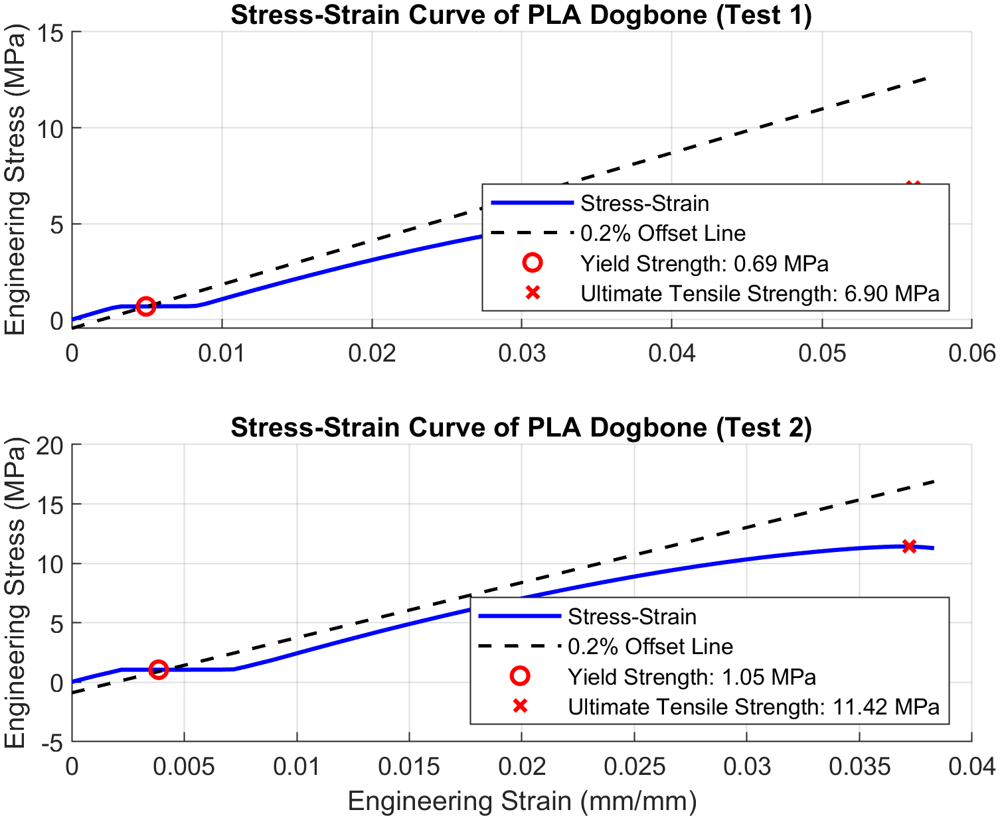
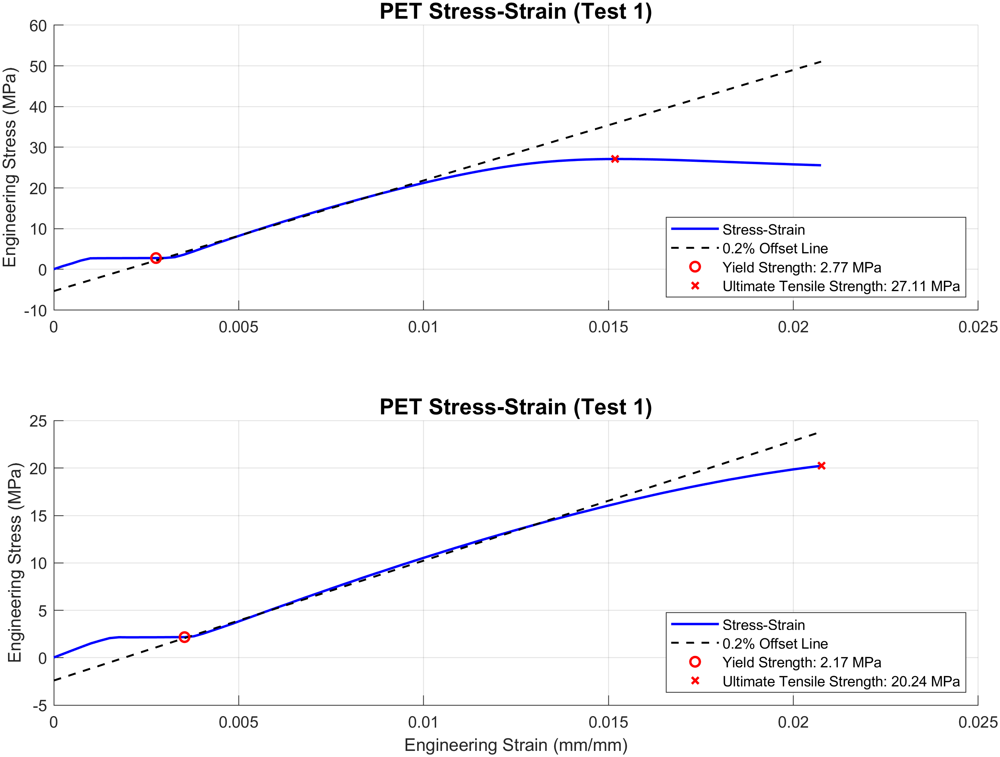

# PLA vs Recycled PET Mechanical Analysis

Mechanical characterization and comparison of 3D-printed PLA and recycled PET filament using tensile testing and stress-strain analysis.

## Overview

This project evaluates the mechanical performance of recycled PET filament produced from water bottles and compares it to standard PLA filament. Tensile testing was performed on dogbone samples using an Instron universal testing machine, and stress-strain curves were generated in MATLAB to extract key material properties.

The goal was to determine whether recycled PET is a viable and sustainable alternative to PLA for 3D printing applications.

## Key Features

* Processing of raw tensile test data into engineering stress-strain curves
* Calculation of yield strength using the 0.2% offset method
* Determination of ultimate tensile strength (UTS)
* Comparison of mechanical properties between PLA and recycled PET
* Visualization of multiple test samples

## Results / Visualization

### PLA Stress-Strain Behavior

  

### PET Stress-Strain Behavior

  

## Results Summary

PLA samples exhibited relatively low yield strength and tensile strength, with values ranging from 0.69–1.05 MPa for yield strength and 6.90–11.42 MPa for ultimate tensile strength (average ≈ 0.87 MPa and 9.16 MPa, respectively).

In contrast, recycled PET samples demonstrated significantly improved mechanical performance. Yield strength ranged from 2.17–2.77 MPa (average ≈ 2.47 MPa), while ultimate tensile strength ranged from 20.24–27.11 MPa (average ≈ 23.68 MPa).

Compared to PLA, PET exhibited:

* ~180–280% higher yield strength
* ~150–250% higher tensile strength

These results confirm that recycled PET provides substantially greater strength and stiffness than PLA. Additionally, PET showed more gradual deformation behavior, indicating improved toughness and ductility relative to the brittle fracture observed in PLA.

## Tools Used

* MATLAB
* Instron Model 34TM-30 Universal Testing Machine

## Methodology

* Dogbone samples of PLA and recycled PET were subjected to tensile loading until failure
* Force and displacement data were recorded
* Engineering stress and strain were calculated from initial geometry
* Yield strength was determined using the 0.2% offset method
* Ultimate tensile strength was identified as the maximum stress

## Technical Contributions

* Developed MATLAB scripts to process experimental tensile data
* Converted raw force-displacement data into stress-strain curves
* Implemented yield strength detection using offset method
* Extracted and compared key mechanical properties across materials
* Generated publication-quality plots for analysis and reporting

## Conclusion

Recycled PET filament demonstrates significantly superior mechanical performance compared to PLA, making it a promising and sustainable alternative for structural 3D printing applications.

## How to Run

1. Download all project files:

   - `Pla_vs_Recycled_Pet_Mechanical_Analysis.m`
   - `pla_tensile_test_1.csv`
   - `pla_tensile_test_2.csv`
   - `pet_tensile_test_1.csv`
   - `pet_tensile_test_2.csv`

2. Open `Pla_vs_Recycled_Pet_Mechanical_Analysis.m` in MATLAB

3. Run the script
